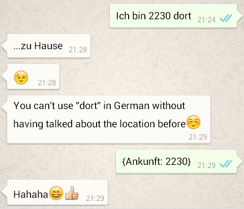

## What is it?
### {[tldr: "inline metadata"]}
 
mBraceSquare is a markup language used to represent metadata in regular text using familiar JSON/CSON syntax

    {[ key: "value" ]}
    
### Example
<pre>> cat ~/student_essays/jimmys_superhero.txt

when I grow up, I want to be big and strong like #JohnCena.

> cat ~/student_essays/jimmys_superhero_corrections.txt

when I grow up, I want to be big and strong like John Cena {[comment: "I know it sounds
cool Jimmy, but please don't use hashtags in your essays."]}.</pre>

---

## Design Goals
### {[tldr: ['legible', 'intuitive', 'tolerant'] ]}
 
mBraceSquare was designed to provide a simple way of representing loosely structured (meta)data in regular text.

 
Implementations of mBraceSquare should be:

- easy to read and interpret

 
- intuitive to write

 
- tolerant of human laziness

---

## Use Cases

 
mBraceSquare is flexible and can be used in many different contexts

### Informal Context

---
## Use Cases

### Formal Context

 
Authoring in Markdown is great and being able to easily add _microdata_ would be cool.

### Insert Microdata

<pre> > cat /srv/http/www.cip.li/blog/_posts/2014-06-06-ilmenau_himmel_blau.markdown

I was in Ilmenau visiting some friends on the weekend and we had a great time! We rented
some donkeys from a {[localBusiness: "Esel und Söhne"]} and rode to the top of the Kickelhahn.
</pre>

### Rendered HTML

I was in Ilmenau visiting some friends on the weekend and we had a great time! We rented
some donkeys from a local business [Esel und Söhne](http://www.zeitblueten.com/news/esel-vater-sohn/) and rode to the top of the Kickelhahn.

---

## Use Cases
### {[tldr: "custom macros"]}
 
Being able to add custom macros in order to extend markdown could also be useful

### Simple Commands

<pre> > cat /srv/http/www.cip.li/blog/_posts/2014-12-22-in_comes_mbracesquare.markdown

So, it's {[date: "currentYear"]} and you may be thinking to yourself, seriously? Do we
really need another Markup language, we already have XML, YAML, HTML, [A-Z]*ML...
</pre>

### API Calls

{[insert: "a good example how calling external APIs could be useful", 
  comment: "any ideas Erik?"]}

---
## {[endOfPresentation: true]}
 

### {[insert: "lame joke goes here"]}
 

{[comments: "let me know what you think, sd@cip.li"]}

